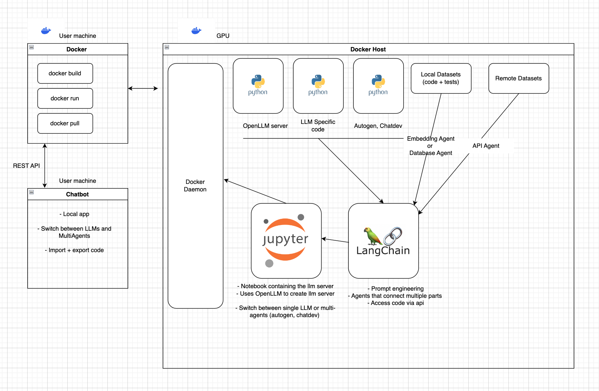

# Project Architecture (DRAFT)

## Introduction

This document provides an overview of the AI software architecture designed to run on school GPUs. The system consists of a Docker-based environment, utilizing Jupyter Notebook as a server, allowing users to access Large Language Models (LLMs) and agents provided by Langchain. The architecture enables seamless communication with both local and remote datasets using Vector Agents or API agents through Langchain.

## Components

### 1. Docker Engine and Container

The system runs on a Docker engine, which hosts a container containing a Jupyter Notebook server. This containerization ensures portability and ease of deployment across different environments. The Jupyter Notebook serves as the primary interface for interacting with the AI models and agents.

### 2. Jupyter Notebook

The Jupyter Notebook acts as a server, providing endpoints to communicate with LLM servers and agents facilitated by Langchain. Users can access these endpoints to interact with the AI models and execute commands. It uses OpenLLM to create llm servers and langchain for prompt engineering. Using OpenLLM, we do not need to install LLMs ourselves, it is done internally and we can use them in our code. 

### 3. Langchain Integration

Langchain integration enables prompt engineering and  seamless communication with local or remote datasets through two types of agents:

#### a. Embedding Agents
Embedding Agents facilitate communication with local datasets, allowing the system to perform operations on the data directly within the AI environment. Users can query, manipulate, and analyze datasets using these agents.

#### b. API Agents
API Agents extend the functionality to interact with remote datasets through APIs. Users can connect to external data sources, fetch data, and perform operations without leaving the Jupyter Notebook environment.

### 4. Docker Client

Users have a Docker client that routes API requests to the local machine. This setup simplifies the process of interacting with the AI models and agents, enabling seamless communication without exposing the complexity of the underlying architecture.

### 5. Local Chatbot

A local chatbot interface is provided, allowing users to interact with the server using natural language commands. The chatbot supports the following features:

#### a. Switch Between LLMs and MultiAgents

Users can seamlessly switch between different Large Language Models (LLMs) and MultiAgents. The system provides options for using autogen or chatdev, allowing flexibility in choosing the appropriate model for the task at hand.

#### b. Import and Export Code (Datasets)

The chatbot allows users to import and export code and datasets, enabling easy sharing and collaboration. Users can import external code or datasets into the Jupyter Notebook environment and export their work for further analysis or sharing with others.

#### c. Fine tune llms (later)

## How to Use

1. **Accessing the server:**
   - Ensure that the Docker engine is running on the school GPUs.
   - Open a conection with your docker client

2. **Interacting with LLMs and Agents:**
   - Utilize the provided endpoints to communicate with LLM servers and Langchain agents.
   - Switch between LLMs and MultiAgents using the chatbot interface.
   - Use Vector Agents to work with local datasets and API Agents for remote data sources.

3. **Using the Docker Client:**
   - Set up the Docker client on your local machine.
   - Route API requests to localhost to interact with the Jupyter Notebook environment seamlessly.

4. **Chatbot Commands:**
   - Use the local chatbot to send natural language commands.
   - Switch between LLMs and MultiAgents (Autogen, Chatdev) by specifying the desired model.
   - Import and export code and datasets using chatbot commands for collaboration and analysis.
